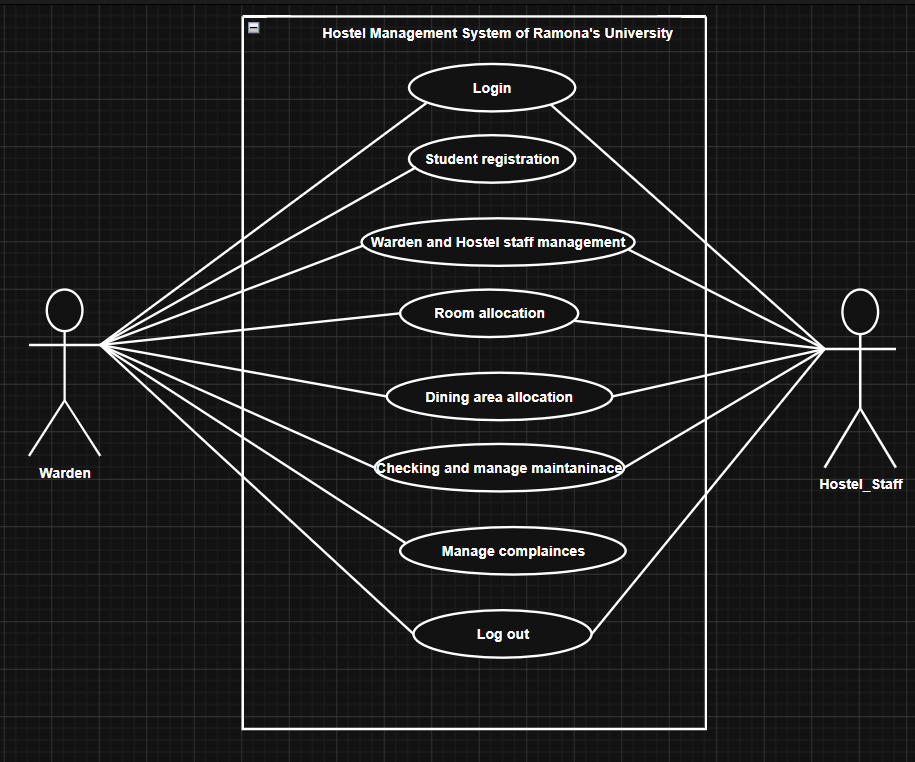
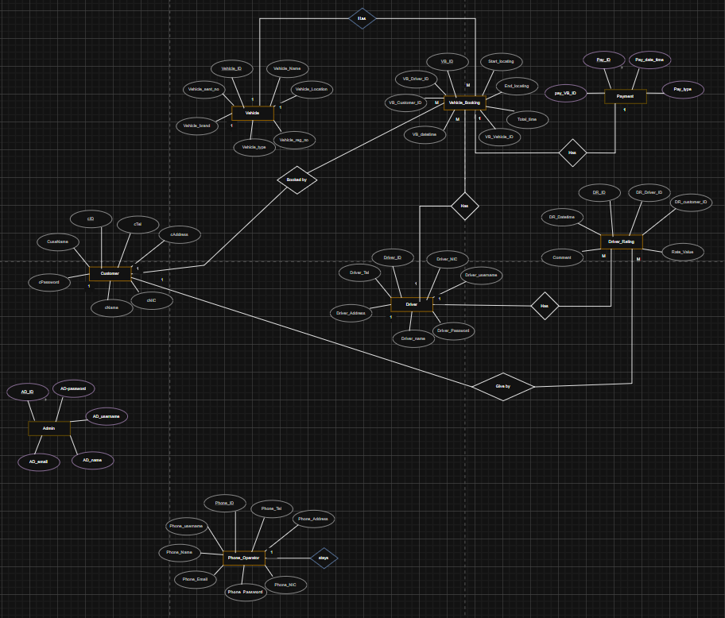
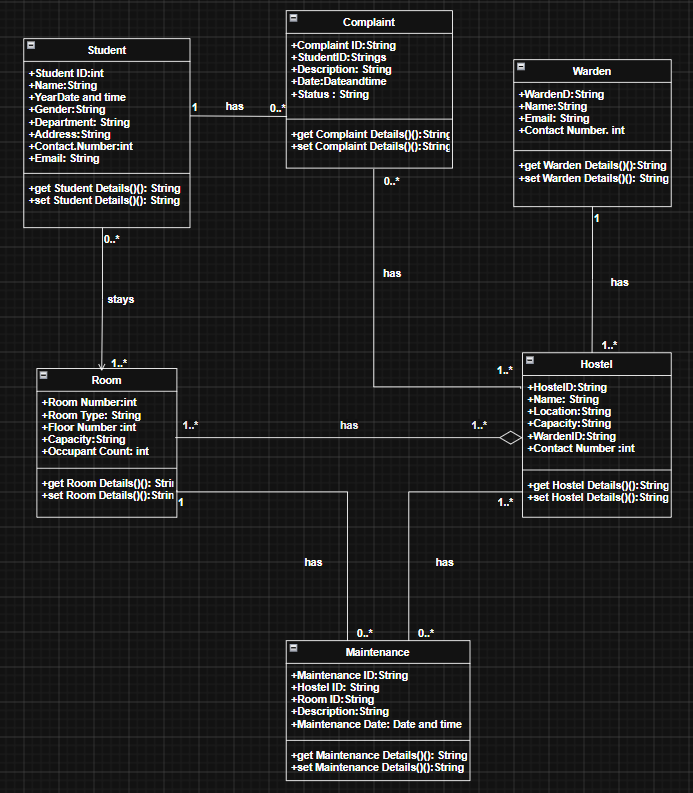

# 🏨 Hostel Management System

A desktop-based Hostel Management System developed using **C# Windows Forms (.NET Framework)** to streamline hostel administration processes. The system provides an efficient way to manage students, rooms, wardens, dining services, maintenance requests, and complaints through a centralized application.

---

# 📌 Project Overview

The Hostel Management System is designed to automate daily hostel operations and reduce manual record-keeping. The application allows hostel administrators to manage student accommodations, room allocations, complaints, dining services, and maintenance activities through a user-friendly interface.

This system improves operational efficiency by providing a centralized platform for hostel management and student services.

---

# 🎯 Objectives

- Manage student hostel records efficiently
- Track room allocations and availability
- Handle student complaints and maintenance requests
- Manage dining hall information and services
- Maintain hostel staff and warden records
- Reduce paperwork and manual administrative tasks

---

# ✨ Key Features

## 👨‍🎓 Student Management
- Add new student records
- Update student information
- View student details
- Manage hostel registrations

## 🏠 Room Management
- Add and manage rooms
- Track room occupancy
- Monitor room availability
- Assign rooms to students

## 👮 Warden Management
- Store warden information
- Update warden details
- Manage hostel supervision records

## 🍽️ Dining Management
- Manage dining hall information
- Maintain meal-related records
- Support hostel food service administration

## 🔧 Maintenance Management
- Record maintenance requests
- Track maintenance status
- Manage repair activities

## 📝 Complaint Management
- Submit student complaints
- Track complaint resolution
- Maintain complaint history

---

# 🏗️ System Architecture

``` id="nrmj6f"
Hostel Administration

        ↓

  Student Management

        ↓

  Room Allocation System

        ↓

Dining & Maintenance

        ↓

 Complaint Handling

        ↓

   Database Storage
```

---

# 📊 Use Case Diagram

The Use Case Diagram illustrates the interactions between users and the system.

Add your Use Case Diagram here:

``` id="5h6h1u"
diagrams/
 └── use_case_diagram.png
```



---

# 📊 Entity Relationship (ER) Diagram

The ER Diagram represents relationships between students, rooms, wardens, complaints, dining services, and maintenance records.

Add your ER Diagram here:

``` id="q66n0e"
diagrams/
 └── er_diagram.png
```



---

# 📊 Class Diagram

The Class Diagram illustrates the object-oriented structure of the system and relationships between classes.

Add your Class Diagram here:

``` id="thx9cr"
diagrams/
 └── class_diagram.png
```



---

# 📂 Project Structure

``` id="u77p6z"
Hostel-Management-System
│
├── Form1.cs
├── Home.cs
├── students.cs
├── rooms.cs
├── warden.cs
├── dining.cs
├── complain.cs
├── maintatinance.cs
│
├── Program.cs
├── App.config
│
├── Properties/
├── Resources/
├── bin/
├── obj/
│
├── diagrams/
│   ├── use_case_diagram.png
│   ├── er_diagram.png
│   └── class_diagram.png
│
├── assets/
│   ├── home_dashboard.png
│   ├── student_management.png
│   └── room_management.png
│
└── README.md
```

---

# 🛠️ Technologies Used

## Programming Language
- C#

## Framework
- .NET Framework
- Windows Forms

## IDE
- Microsoft Visual Studio

## Database
- SQL Server / Local Database (Update according to your project)

## Design Methodologies
- Object-Oriented Programming (OOP)
- Entity Relationship Modeling
- UML Diagrams

---

# ⚙️ Installation

Clone the repository:

```bash
git clone https://github.com/yourusername/Hostel-Management-System.git
```

Open the project in Visual Studio:

``` id="gcbz9g"
Hostal Management.sln
```

Build and run the application.

---

# ▶️ Running the Application

1. Open the solution file in Visual Studio
2. Restore required packages
3. Build the project
4. Run the application

---

# 🚀 Future Enhancements

- Student login portal
- Online hostel registration
- Attendance management
- Fee management system
- Email/SMS notifications
- Reporting and analytics dashboard
- Database integration improvements

---

# 👩‍💻 Author

**Your Name**

Software Developer | .NET Developer

---

# ⭐ Support

If you found this project useful, consider giving it a ⭐ on GitHub.
